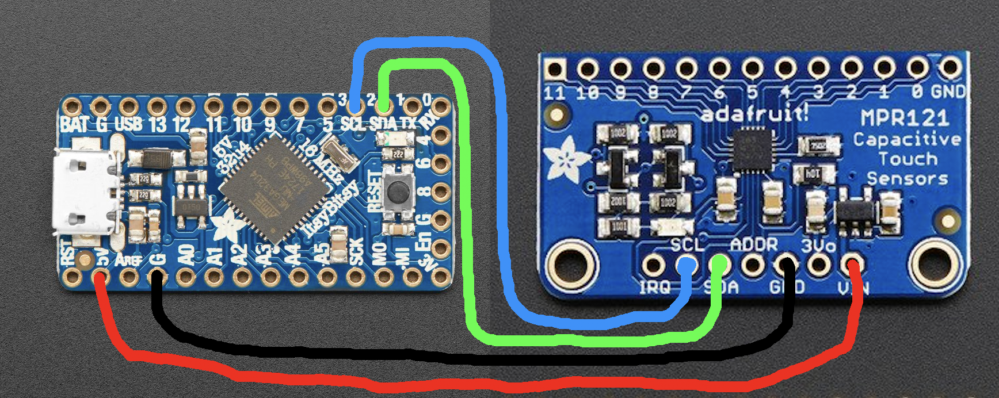
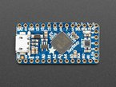
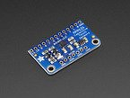
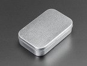
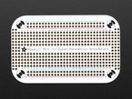

# midi-mints
A capacitive-touch MIDI controller in an Altoids can for NUSound.

## Overview
The great thing about this project is that both the code and the 
hardware are incredibly minimal thanks to the wonderful capabilities
of Adafruit's MPR121 breakout board. With a simple I2C interface, the
MPR121 handles all of the sensing, leaving the ItsyBitsy's Atmega32u4
to handle the USB MIDI.

The MPR121 calibrates on startup, so there is no need to mess with
the sensitivity. You can use the reset button on the ItsyBitsy to 
recalibrate if need be. 

## Schematic
Both boards fit on the same protoboard, and Adafruit sells one designed
specifically for use in an Altoids can. Here is a quick summary of the
pin-to-pin connections between the ItsyBitsy and the MPR121:

| ItsyBitsy   | MPR121 |
|-------------|--------|
| 5V          | VIN    |
| GND         | GND    |
| Pin 2 [SDA] | SDA    |
| Pin 3 [SCL] | SCL    |

Fortunately, the I2C pins on the ItsyBitsy are clearly labeled,
so the connections are very straightforward.

For accessing the 12 sensing pins on the MPR121, get creative! You 
can connect them to pretty much anything using wires, gator clips or jumpers.
Personally, I've used plants and even pizza at past meetings. The 
latter turned out to be pretty gross, but it still worked.

## Parts
Aside from wires and standoffs, there are only four main components.
### [Adafruit ItsyBitsy 32u4](https://www.adafruit.com/product/3677)

### [Adafruit MPR121 Breakout](https://www.adafruit.com/product/1982)

### [Altoids Can](https://www.adafruit.com/product/97)

### [Altoids Protoboard](https://www.adafruit.com/product/723)
